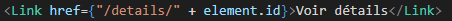

# Expertise

Ce projet est un projet NextJS crée par Nicolas Gerard pour le sujet d'Expertise de Master 2

## Contexte

Pour le cours d'Expertise nous avons dû choisir un sujet à étudier et à démontrer.
Pendant les premières séances, j'ai d'abord choisi le sujet : "Automatisation des tests unitaires" pour donner suite à un souci de perte de temps en alternances à cause des tests unitaires.
Cependant après étude de Cucumber, j'ai choisi de choisir un autre sujet qui m'intéresserais plus.
J'ai donc souhaité étudier un Framework sur un langage populaire : le JavaScript

En premier temps j'ai effectué des recherches sur ReactJS car j’avais déjà étudié et travailler avec les autres Framework AngularJS et VueJS et j’avais envie de découvrir un nouveau framework.

Je me suis ensuite rendu compte qu’un Framework existait pour ReactJS (Un framework de framework oui)

Après m’être penché sur les pours et les contres j’ai décidé de faire de NextJS mon sujet d’étude pour la matière d’expertise

## Les difficultées rencontrées pendant la mise en place / realisation du projet

J’ai rencontré plusieurs difficultés pendant la mise en place de cette étude et la finalisation de mon sujet d’expertise :

- J’ai décidé de changer de sujet il y a 3 séances, lors du mois de janvier
- Depuis lors j’ai raté les deux séances qui ont eu lieux
- Je n’ai pas pu travailler sur le sujet d’expertise pendant la dernière semaine, en effet j’ai eu un accident de sport le Dimanche 27 Février avec arrêt de travail jusqu’au 8 Mars (1 jour après la date de rendu) avec ordre du médecin de rester allonger (entorse de la cheville droite).

## Site de démo de NextJS

Afin de démontrer comment fonctionne NextJS (avec son API intégrée au projet) j’ai choisi de produire un site qui sert de bibliothèque qui regroupe des informations sur certains smartphones (spécifications, fabricant etc...)

Sur ce site, plusieurs « cartes » avec les noms des smartphones et des spécifications de bases sont présentes.
Il est possible de cliquer sur « Voir détails » afin d’aller sur une autre page qui montre tous les détails du smartphone.

Je rentrerais en détails sur les spécificités NextJS utilisée et les découvertes / difficultés rencontrées avec ce Framework dans la partie suivante

## Commencement

Une fois le projet clonné avec git il faut lancer la commande :

```bash
npm run dev
# ou
yarn dev
```

pour lancer le serveur, accessible sur http://localhost:3000/

## Structure du projet

Le projet a été mis en place grâce à la commande :

```bash
npx create-next-app@latest
```

Ce qui génère un projet Next.

Dans ce projet Next on retrouve un découpage en « pages »


Avec a l’intérieur le dossier qui contient notre API


Nos composants (header footer et notre layout)
Le layout sert à avoir un modèle "fixe" pour toutes les pages et éviter d’importer tout le temps notre header et footer


## Spécificitées NextJS

En spécificités NextJS utilisées il y a plusieurs choses :

- La structure de l’api :

  

On peut voir que j’ai créé un dossier « phone » avec un fichier [id].js, ce nommage de fichier sert à signaler a NextJs que cette requête d’API va utiliser un id passé lors de la requête.
Grâce à cette structure quand on appelle http://localhost:3000/api/phone/1 notre api va nous retourner le téléphone avec l’ID 1

- La structure de la page détail :

  

  Comme l’api, on retrouve une page avec un nom [id].js, ceci va également nous permettre d’avoir un lien vers la page http://localhost:3000/details/1 qui va récupérer l’id et faire la requête d’api qui correspond

  - Le style css global

    

    Grâce à NextJS, il est possible d’appliquer un style « global » qui sera présent sur toutes les pages

- Les éléments Link et Head de NextJS

  

  

Ces éléments sont propres a NextJS et permettent d’optimiser les charges des pages sur notre site

## Difficultés rencontrées

Pendant mon projet j'ai rencontré plusieurs difficultés dues à mon manque d’expérience sur NextJS.

Je n’avais aucune idée de comment fonctionnent les pages et la navigation sur NextJS, j’ai donc mis longtemps avant de trouver comment faire la structure [id].js et j’ai dû recommencer plusieurs fois des pages.

J’ai voulu insérer des images des smartphones sur la page d’accueil et la page de détails, mais deux problèmes s’en sont suivit :

Les liens que j’avaient sont des gifs et non pas des images, et pour pouvoir insérer des images dans une page NextJS il faut déclarer la source de l’image comme valide dans le fichier « next.config.js ». J’ai essayé de faire cette manipulation cependant l’erreur a persistée et je n’ai toujours pas trouvé la réponse.

C'est dommage car la balise Image propre à NextJS permet d'optimiser et de réduire largement le poids de l'image, ce qui aurait permis de démontrer que même avec beaucoup d’images, les performances de NextJS sont bonnes

J'ai aussi bêtement eu des soucis avec le format JSON retourné par l'API, car sur un format JSON le mapping n'est pas possible pour crée des balises, j'ai donc changer la forme de mon JSON pour inclure un Array d'objets a la place

## Conclusion

En conclusion, j’ai rencontré beaucoup de soucis pour ce projet d’expertise, je ne suis pas forcément satisfait du résultat mais en vue de certains soucis que j’ai rencontré je pense avoir réussi à étudier quand même les bases de NextJS.
Cependant, je n’aime pas beaucoup son utilisation, c’est peut-être dû à mon manque d’expérience sur le sujet mais un Framework de Framework rajoute beaucoup de difficultés qui selon moi n’est pas nécessaire.

Les points de retour que j’ai notés sont les suivants :

J’ai du mal à voir l’utilité de l’API inclue dans le projet, elle est très limitée et compliquée à mettre en place comparée à une API NodeJS avec Express seule.

J’ai peut-être raté quelque chose mais le format des fichiers et très confus et a juste servis à me ralentir dans la mise en place de mes pages et de l’api, nommer un fichier [id].js est étrange et gênant même.

La navigation est compliquée dans NextJS, j’ai l’habitude et trouve plus simple un « Navigateur » qui permet de changer le contenu d’une page plutôt que des liens qui ouvrent d’autres pages.

Je pense que l’expérience acquise a été bonne à prendre et m’aidera à décider plus tard sur les Framework disponibles.

Cependant je pense que ce choix ne s’orientera pas vers NextJS.
J’aimerais voir ReactJS sans le Framework ajouté pour comparer a Angular que j’utilise dans mon alternance.

Pour finir, je dirais que j’ai trouvé l’expertise assez intéressante surtout avec les retours pendant les cours mais j’aurais aimé avoir plus de temps disponibles pour travailler mon sujet et produire un rendu de meilleure qualité.
Merci d’avoir lu ce readme long, et j’espère que mon rendu répondra a un maximum de critères attendus.
